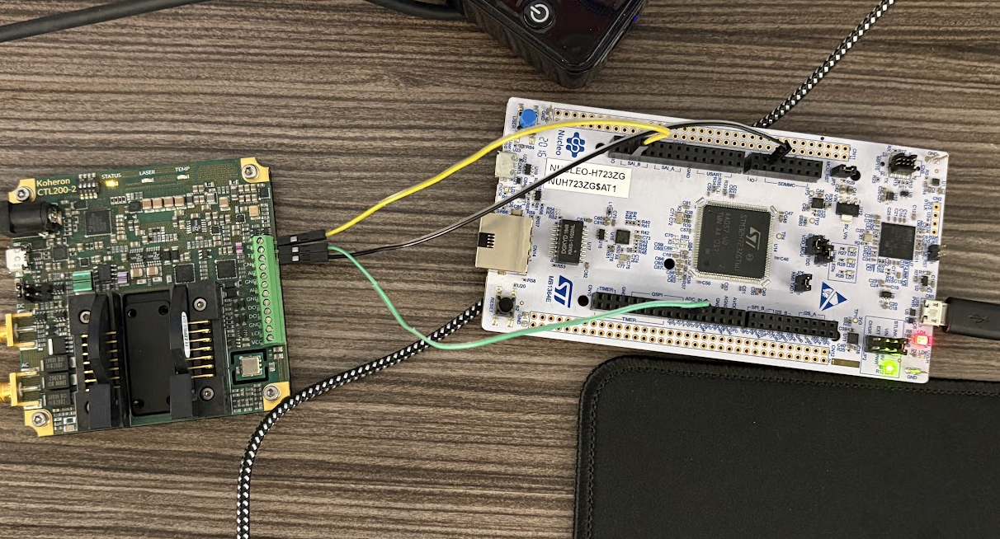

## Experimental examples
### Blinky
Connect the MicroUSB with the NUCLEO board, and run the command below:
```
cargo run --package ferox --example blinky
```

You should see the RED led flash and output on your screen.

### UART demo
Wire `GND` / `TX` / `RX` between the board and the TTY-USB board correctly. (similar to [this diagram](https://microcontrollerslab.com/wp-content/uploads/2021/12/STM32-with-FTDI-programmer-connection-diagram.jpg))

Plug both of the USBs (NUCLEO & TTY-USB) into your host machine. If your TTY-USB is use `/dev/ttyUSB0`, you can use command below to communicate with the serial port:
```
picocom /dev/ttyUSB0 -b 115200 --omap crcrlf --imap lfcrlf
```

Then run command below to flash the code into your NUCLEO:
```
cargo run --package ferox --example usart_split
```

You should be able to connect the two devices.

### CTL200


CTL200 <=(UART)=> NUCLEO (STM32H723ZGT6)

Based on the wiring, you can run command below to connect CTL200 and STM32:
```shell
cargo run --package ferox --example ctl200
```

and below is the expected result:
```
INFO  CTL200 Test Starting!
└─ ctl200::____embassy_main_task::{async_fn#0} @ /home/xguo/va/ferox/ferox/examples/ctl200.rs:60  
TRACE USART: presc=1, div=0x0000022c (mantissa = 34, fraction = 12)
└─ embassy_stm32::usart::configure @ /home/xguo/.cargo/registry/src/index.crates.io-6f17d22bba15001f/embassy-stm32-0.1.0/src/fmt.rs:117 
TRACE Using 16 bit oversampling, desired baudrate: 115200, actual baudrate: 115107
└─ embassy_stm32::usart::configure @ /home/xguo/.cargo/registry/src/index.crates.io-6f17d22bba15001f/embassy-stm32-0.1.0/src/fmt.rs:117 
INFO  Sent CRLF
└─ ctl200::wait_for_prompt::{async_fn#0} @ /home/xguo/va/ferox/ferox/examples/ctl200.rs:24  
INFO  No prompt received, retrying...
└─ ctl200::wait_for_prompt::{async_fn#0} @ /home/xguo/va/ferox/ferox/examples/ctl200.rs:34  
INFO  Sent CRLF
└─ ctl200::wait_for_prompt::{async_fn#0} @ /home/xguo/va/ferox/ferox/examples/ctl200.rs:24  
INFO  Prompt received!
└─ ctl200::wait_for_prompt::{async_fn#0} @ /home/xguo/va/ferox/ferox/examples/ctl200.rs:30  
INFO  Sent version command
└─ ctl200::____embassy_main_task::{async_fn#0} @ /home/xguo/va/ferox/ferox/examples/ctl200.rs:68  
' (0x[d])eived char: '
└─ ctl200::read_response::{async_fn#0} @ /home/xguo/va/ferox/ferox/examples/ctl200.rs:47  
INFO  Received char: '
' (0x[a])
└─ ctl200::read_response::{async_fn#0} @ /home/xguo/va/ferox/ferox/examples/ctl200.rs:47  
INFO  Received char: '>' (0x[3e])
└─ ctl200::read_response::{async_fn#0} @ /home/xguo/va/ferox/ferox/examples/ctl200.rs:47  
INFO  Received char: '>' (0x[3e])
└─ ctl200::read_response::{async_fn#0} @ /home/xguo/va/ferox/ferox/examples/ctl200.rs:47  
INFO  Received char: 'v' (0x[76])
└─ ctl200::read_response::{async_fn#0} @ /home/xguo/va/ferox/ferox/examples/ctl200.rs:47  
INFO  Received char: 'e' (0x[65])
└─ ctl200::read_response::{async_fn#0} @ /home/xguo/va/ferox/ferox/examples/ctl200.rs:47  
INFO  Received char: 'r' (0x[72])
└─ ctl200::read_response::{async_fn#0} @ /home/xguo/va/ferox/ferox/examples/ctl200.rs:47  
INFO  Received char: 's' (0x[73])
└─ ctl200::read_response::{async_fn#0} @ /home/xguo/va/ferox/ferox/examples/ctl200.rs:47  
INFO  Received char: 'i' (0x[69])
└─ ctl200::read_response::{async_fn#0} @ /home/xguo/va/ferox/ferox/examples/ctl200.rs:47  
INFO  Received char: 'o' (0x[6f])
└─ ctl200::read_response::{async_fn#0} @ /home/xguo/va/ferox/ferox/examples/ctl200.rs:47  
INFO  Received char: 'n' (0x[6e])
└─ ctl200::read_response::{async_fn#0} @ /home/xguo/va/ferox/ferox/examples/ctl200.rs:47  
' (0x[d])eived char: '
└─ ctl200::read_response::{async_fn#0} @ /home/xguo/va/ferox/ferox/examples/ctl200.rs:47  
INFO  Received char: '
' (0x[a])
└─ ctl200::read_response::{async_fn#0} @ /home/xguo/va/ferox/ferox/examples/ctl200.rs:47  
INFO  Received char: 'V' (0x[56])
└─ ctl200::read_response::{async_fn#0} @ /home/xguo/va/ferox/ferox/examples/ctl200.rs:47  
INFO  Received char: '0' (0x[30])
└─ ctl200::read_response::{async_fn#0} @ /home/xguo/va/ferox/ferox/examples/ctl200.rs:47  
INFO  Received char: '.' (0x[2e])
└─ ctl200::read_response::{async_fn#0} @ /home/xguo/va/ferox/ferox/examples/ctl200.rs:47  
INFO  Received char: '1' (0x[31])
└─ ctl200::read_response::{async_fn#0} @ /home/xguo/va/ferox/ferox/examples/ctl200.rs:47  
INFO  Received char: '7' (0x[37])
└─ ctl200::read_response::{async_fn#0} @ /home/xguo/va/ferox/ferox/examples/ctl200.rs:47  
' (0x[d])eived char: '
└─ ctl200::read_response::{async_fn#0} @ /home/xguo/va/ferox/ferox/examples/ctl200.rs:47  
INFO  Received char: '
' (0x[a])
└─ ctl200::read_response::{async_fn#0} @ /home/xguo/va/ferox/ferox/examples/ctl200.rs:47  
INFO  Received char: '>' (0x[3e])
└─ ctl200::read_response::{async_fn#0} @ /home/xguo/va/ferox/ferox/examples/ctl200.rs:47  
INFO  Received char: '>' (0x[3e])
└─ ctl200::read_response::{async_fn#0} @ /home/xguo/va/ferox/ferox/examples/ctl200.rs:47
```